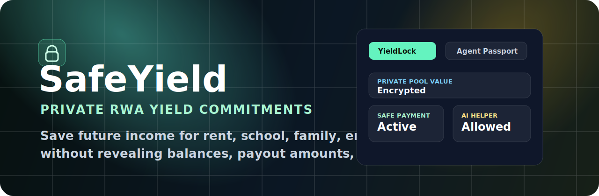
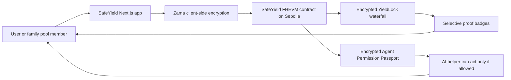

# SafeYield



<p align="center">
  
  
  
  
  
</p>

**Private RWA yield circles with FHE YieldLock commitments and encrypted agent permissions.**

SafeYield lets people, families, and communities privately pool tokenized RWA yield, route future income into real-life commitments, and let AI agents assist only after encrypted permission checks pass.

## Problem

Real-life financial commitments are funded from sensitive income streams: rent from a shared property, family support, school fees, emergency savings, supplier payments, or freelance earnings. Today, proving that a commitment is funded usually means exposing balances, income history, payout amounts, or reliability signals.

That privacy tradeoff is painful for ordinary people. Families and communities need financial coordination, but they should not have to reveal every contribution, reserve buffer, trust score, or agent fee just to prove that a payment plan is real.

## Solution

SafeYield uses Zama FHE so users can compute over private income and yield data while the actual numbers stay encrypted.

- **Create a private income pool:** deposit into a shared RWA or future-income pool without exposing member balances.
- **Lock yield for real commitments:** route future income toward rent, school fees, family support, emergency savings, supplier payments, or reinvestment.
- **Approve AI helpers privately:** agents can only act after encrypted checks confirm fee limits, task type, agent score, and pool safety.

## Core Primitive: YieldLock

**YieldLock** turns private future yield or income into encrypted commitments for real-life obligations.

The contract computes over encrypted values:

- private contribution and RWA NAV
- yield received
- reserve buffer
- safe withdrawal amount
- commitment amount
- user yield share
- CircleScore
- agent x402 fee, fee cap, score, solvency, and permission result

## Architecture



## Tech Stack

- **Smart contracts:** Solidity, Zama FHEVM, Foundry
- **Frontend:** Next.js, React, Tailwind CSS, RainbowKit, Wagmi, Viem
- **Encryption SDK:** `@zama-fhe/react-sdk`, `@zama-fhe/sdk`
- **Network:** Sepolia

## Deployment

- **Network:** Sepolia
- **SafeYield contract:** `0xb892c20480FE14607ba8780B8768A9eA3f8611bC`

## Hackathon Tracks Targeted

**Zama Developer Program - Onchain Finance**

SafeYield directly targets confidential finance by using FHE to compute private yield allocations, reserves, commitments, user scores, and agent permissions without revealing the underlying financial data.

## Demo Flow

1. Create a Private Yield Circle.
2. Compute the FHE YieldLock waterfall.
3. Submit an Agent Permission Passport.
4. Execute YieldLock.
5. Reveal selective proofs such as commitment active, yield eligible, and agent allowed.

## Quick Start

```bash
pnpm install
pnpm contracts:build
pnpm contracts:test
pnpm next:check-types
pnpm start
```

The local demo runs at:

```text
http://localhost:3001
```

Create `.env.local` from `.env.example`:

```bash
cp .env.example .env.local
```

Required values:

```env
SEPOLIA_RPC_URL=https://ethereum-sepolia-rpc.publicnode.com
DEPLOYER_PRIVATE_KEY=
NEXT_PUBLIC_SEPOLIA_RPC_URL=https://ethereum-sepolia-rpc.publicnode.com
NEXT_PUBLIC_WALLET_CONNECT_PROJECT_ID=
```

Use a burner wallet for deployment and testing.

## Project Layout

- `packages/foundry/src/SafeYield.sol` - FHEVM contract.
- `packages/foundry/test/SafeYield.t.sol` - contract tests.
- `packages/foundry/script/DeploySafeYield.s.sol` - deployment script.
- `packages/nextjs/components/SafeYieldConsole.tsx` - working demo UI.
- `packages/nextjs/hooks/safeyield/useSafeYield.tsx` - encrypted onchain interaction hook.
- `packages/nextjs/contracts/SafeYield.ts` - frontend ABI/deployment binding.
